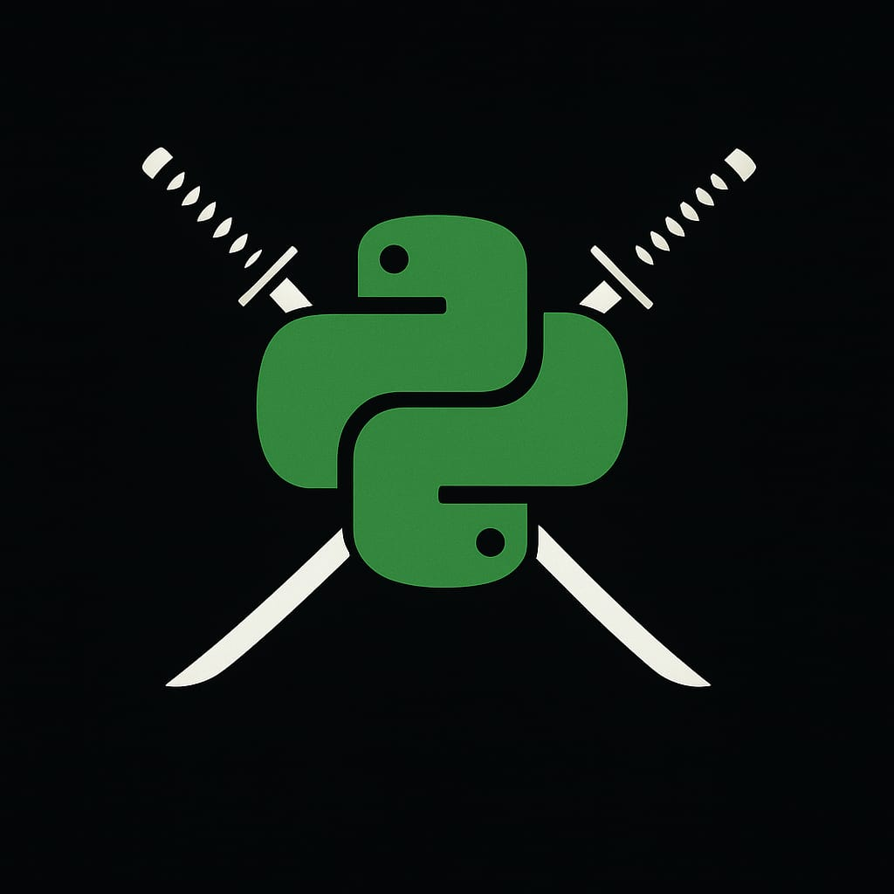

  
  

## ⚔️ Python Arsenal — The Ultimate Developer's Weapon Cache
Welcome to **Python Arsenal**, your tactical hub for Python mastery.  
This repository is built like an elite-level inventory — packing detailed, example-driven documentation for:

- 🧠 **Built-in Libraries** (like `random`, `os`, `itertools`, etc.)
- 🚀 **Third-party Libraries** (like `NumPy`, `Pandas`, `Matplotlib`, and more)

Whether you're building a project, prepping for an interview, or just sharpening your Python skills, this repo is your go-to battlefield companion.

